# Hardware - rpi Bare Metal Looper

**[Home](readme.md)** --
**Hardware** --
**[Software](software.md)** --
**[UI](ui.md)** --
**[Protocols](protocols.md)** --
**[Details](details.md)** --
**[Looper1](looper1.md)** --
**[Looper2](looper2.md)**

This readme file describes the physical hardware
implementation of the *rPi Bare Metal Looper*, which *includes* the specific **sound card**
I am using, the *Audio Injector Octo*, as well as the **separate teensy 3.2**
running the *[teensyPiLooper](https://github.com/phorton1/Arduino-teensyPiLooper)*
INO program.

## rPi3B+, AudioInjector Octo, and Official Raspberry Pi 7" Touchscreen

Below shows the basic stack, with the rPi on the bottom, and the Octo on top.

The RCA ports for the Octo have been routed out the back of the box, and the
Touchscreen ribbon cable and power supply positioned to allow the screen to
move on the hinges.

[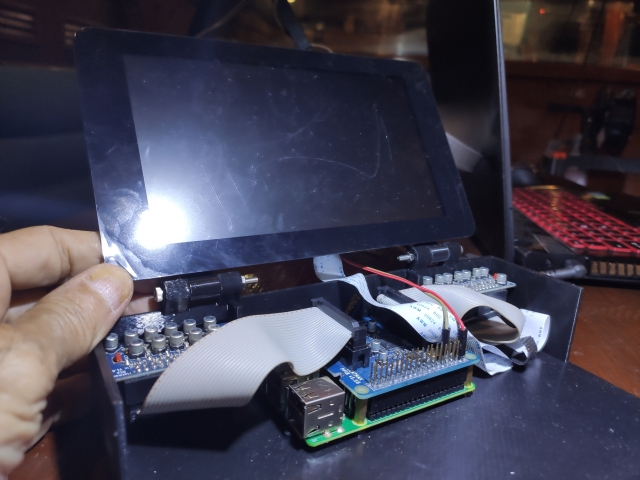](images/hw01-minimumBox.jpg)

This prototype, early version, shows, essentially, the minimum physical
configuration necessary to run this *Looper* program, or other applications
like this that make use of the *circle-prh* framework. You want a **screen**
of some kind, and a *pointer* input device (the HDMI port and a 40" television,
with a USB mouse were used for most of the development), and a
*high quality sound card* that does *bi-directional* audio.

Getting it down to the **7" touchscreen**, in a box I can put on the floor,
really cleared things up for me.  When I (finally, after more than
a year of development) hooked up the 7" Pi Touchscreen, it basically
worked the first time, within the Circle framework, with no, or
only very minor changes to my code.

[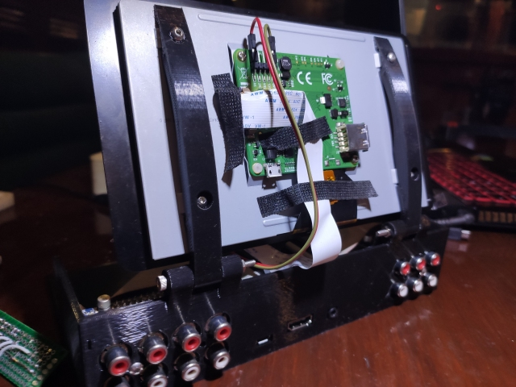](images/hw02-minimumBoxBack.jpg)

In the above photo you, on the back of the box can see the **8 RCA outputs** from, and the
**6 RCA inputs** to the Octo, and the holes where the rPi micro USB **power** attaches,
and holes for the (unused) rPi HDMI and headphone jacks.

***TODO: I should** publish an analysis of the pin usage by the AudioInjector
Octo, even better yet, a kicad circuit diagram for the rpi, octo, and teensy.
It was hard to ferret out which (other) pins on the rPi I could
reliably use.   In fact, a discussion of I2S might be appropriate here.*

One ***could*** compile the code in this repository, and just *hook the rPi, Octo,
and touchsreen together*, stick the **kernel.img** on an SD card, and it
*would/should* boot and run the *Looper Program*.
 *I am considering publishing a pre-built **kernel.img** "distro"*.

## Teensy 3.2, indicator LEDs, and buttons

I'm not a big fan of swapping SD cards in and out of the rPi. So,
for better or worse, very early on the *circle* project I developed
my own **boot-loader** for the rPi, written in Circle, that can
(among other things), accept a new **kernel.img** over the serial
port, run it, and/or store it on the SD Card for the next reboot.

Historically, I have used a teensy 3.2 as a *smart*
substitute for a typical rs232 usb dongle for serial
(debugging) comms with the rPi.  A hardware serial
port on the teensy is connected to the rPi, and the teensy
serves to forward bi-directional serial text (among other things),
between the rPi and the teensy's *standard* USB Serial port
on my Windows machine.

This architcture (and circuit) goes back to my
[TeensyPi Breakout Breadboard](https://hackaday.io/project/166117-teensypi-breakout-breadboard)
**hackaday** project, and is essentially, with minor changes, a
copy of the breadboarded circuit
from that project.

[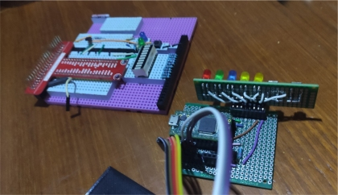](images/hw03-teensyWithPrototype.jpg)

Included in this circuit is the ability for the teensy to **reboot the rPi**,
by grounding it's *RUN* (reset) pin.
The circuit uses a **transistor** to control the grounding
of the rPi's *RUN* pin via one of the teensy's GPIO
output pins.
In addition to adding the *header* for the *RUN* pin to the
**rPi board**, I also had to cut a small *notch* into the side
of the **Octo circuit board**, fortunately into the *ground plane*, so that
I could *access* that RUN pin while the Octo is plugged in on top of the
rPi as a *hat*.

#### Hardware relation to Development Environment

This is some more context for the teensyPi evolution and
why this board is part of my *standard application development*
environment.
For what it's worth, my circle **bootloader** interfaces with
a perl program on my Windows machine, the putty-like **CONSOLE**,
that also can work with the Arduino Development Environment,
opening and closing the com port as necessary to prevent
conflicts.

The CONSOLE notices when I have recompiled *kernel.img*.  It tells the
teensy to *reboot the Pi*.  When the Pi reboots, my *bootloader*
runs first (as **recovery.img**) and displays a message (over the serial port)
something like ...

    "hit return to send kernel - will boot existing kernel in 3 seconds .."

... which the CONSOLE program then "sees" and, in response, sends a carriage
 return, and then procedes to the send the kernel.img to the Pi via
 the teensy with a binary serial protocol.
 If the bootloader does not see a carriage return (character 0x0d = 13) in
 three seconds, it just goes ahead and loads and begins running the kernel.img
 from the SD card.

### LED Circuit Board

**In any case**, all of my bare metal rPi projects include this basic
**teensy circuit**, and a couple of *buttons* and some *LED indicators*.

[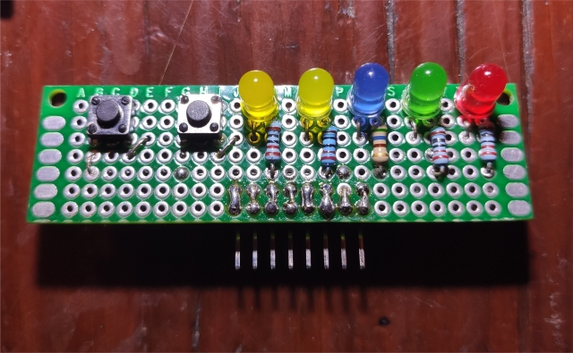](images/hw04-LEDBoard.jpg)

The buttons are, from left to right:

- **reboot** the Pi
- put the Teensy in **program mode**

The LEDS, from right to left, are

- **red** - flashes when the teensy is **alive** (copy of the "standard" Arduino/Teensy pin13 onboard led)
- **green** - follows the rPi **RUN** signal where *HIGH* (on) means the rPi
  RUN (reset) pin is "high" (and the **rPi is  running**), or *LOW* (off),
  for brief periods of time, meaning we have brought the rPi "RUN" pin LOW and
  are in the process of rebooting it.
- **blue** - shows the state of the rPi GPIO pin 25, which indicates  that the *std_kernel*
  has **started correctly** .. that
  the *"application"*, the *"program"*, in this case the *Looper* ... the *kernel.img* ...
  has booted correctly  and is **"ready"**. This rPi GPIO pin is **monitored** by the teensy ...
  it is an *input* to one of the teensy's GPIO pins.
- **yellow** - the two yellow LEDs are connected directly to two GPIO pins (12 and 16) from the rPi.
  They *do not go through the teensy*.  Those two LEDs are used by the *AudioSystem* to indicate
  that it is properly processing **I2S** interrupts and buffers, and will flash on and off
  every 90 interrupt/buffers or so (they should flash "on" about 2 times a second).

Please see the [Software](software.md) readme for more info about the **std_kernel** and
the **AudioSystem**

### Teensy Circuit Board

[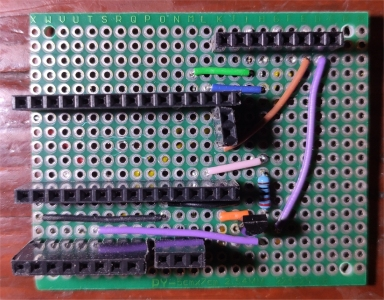](images/hw05-CircuitBoardFront.jpg)
[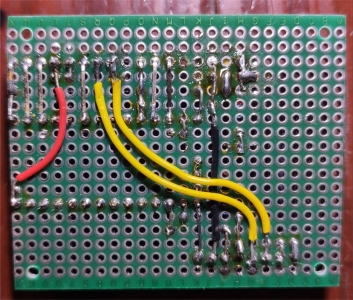](images/hw06-CircuitBoardBack.jpg)

The teensy circuit board, in the "top" image above, has connectors for

- 8 pin connector to the **LED/Button Board** at the *top right*
- two rows of 14 pin connectors, and a sideways 2 pin connector, for the **teensy 3.2**
  and it's **program pin** to plug into, in the *center*
- an 8 pin connector to connect to the *rPi* via the **teensy-rPi connector**, and
- a 3 pin connector for a second hardware serial port, that is brought out to the
side of the box to a 1/8" jack, that is used to connect to the
*[teensyExpression Pedal](https://github.com/phorton1/Arduino-teensyExpression)*,
as shown below.

[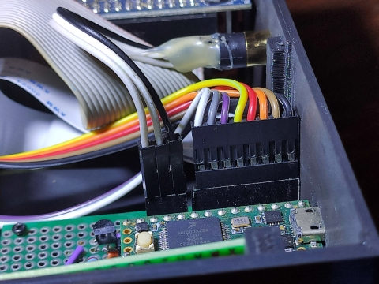](images/hw08-SerialPortConnector.jpg)

I also had to add a pin to the teensy to bring the *PGM* **program** signal down
to the teensy circuit board, where it can be connected to the button on the LED board.

[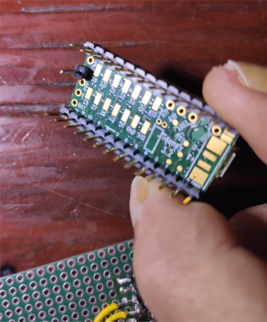](images/hw07-tennsyWithPin.jpg)

### Teensy-RPi Connector

I kind of like how this connector came out.  I have long struggled with how to
make one-off connections to the top of an rPi stack.

I started by sticking some nylon supports and a **female header** on the pins
from the *Octo*:

[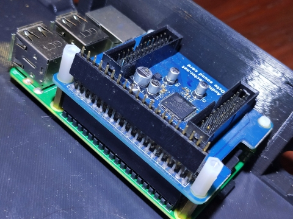](images/hw-connector01.jpg)

Plunked a small circuit board on top of it:

[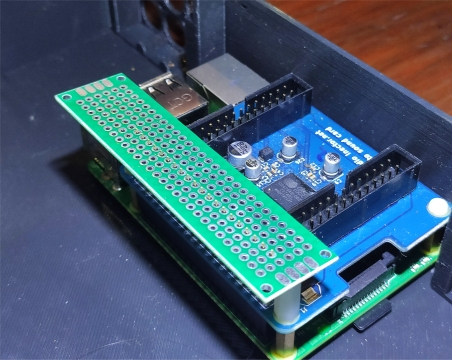](images/hw-connector02.jpg)

Then cut it to size ....

[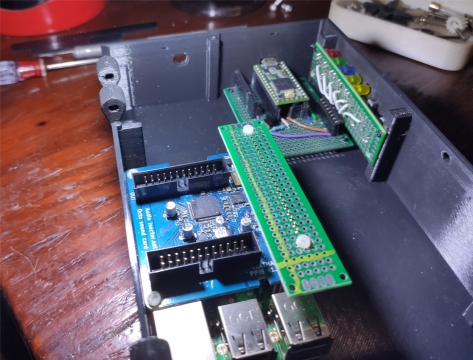](images/hw-connector03.jpg)

*Note that in the above image you can see the **notch**
that I cut into the *Octo circuit board* to be able to get to the *RUN* pin
on the rPi*.

I then used that circuit board to create a connector between the rPi and the
teensyCircuit board that I can fasten securely with nylon screws.

[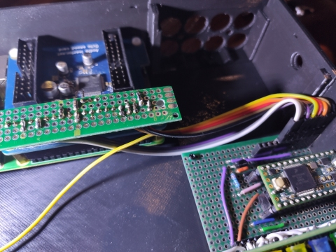](images/hw-connector04.jpg)

by soldering standard, pre-made wires with *dupont male connectors* on one end,
which I then combined into a **single 8-pin plug** that connect to the *teensy
circuit board*.

The **yellow** wire trailing off to the bottom left in the above photo goes
from the *connector* to the *RUN* pin on the rPi, and then through the cable
to the *teensy circuit board*.

The connector also has two pins (you can't see, on the underside) for the
**power** to the *rPi touch screen*.

## Final (initial) Assembly

Below is a photo of the basic components assembled together in the
initial *instance* of the physical 3D printed box, [Looper1](looper1.md),
running an earlier version of this *Looper* program.

[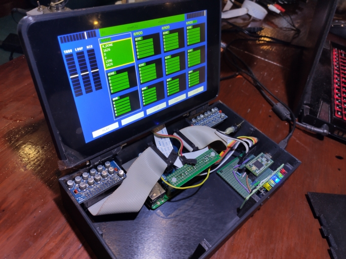](images/hw08-Looper1Guts.jpg)

*--------------- end of hardware.md --------------------*