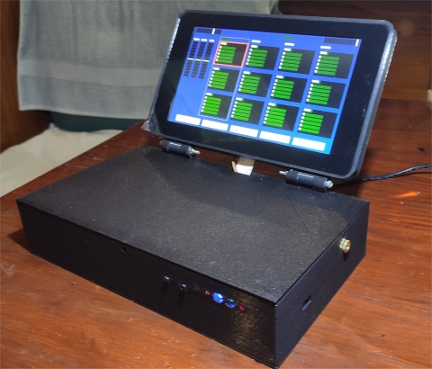
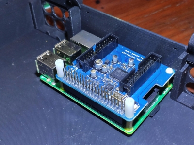
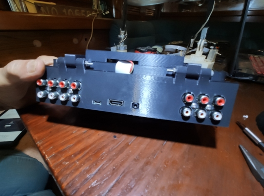

# Looper1: the initial instance of the box

**[Home](readme.md)** --
**[Hardware](hardware.md)** --
**[Software](software.md)** --
**[UI](ui.md)** --
**[Protocols](protocols.md)** --
**[Details](details.md)** --
**Looper1** --
**[Looper2](looper2.md)**

This readme file describes the first instance of the **phsycial 3D printed** box
I created for the *rPi Bare Metal Looper* and how it fits into my overall
*[rPi bare metal vGuitar rig](https://hackaday.io/project/165696-rpi-bare-metal-vguitar-rig)*
project.

As it came first, the subsequent *[Looper2](looper2.md)* can be viewed to **inherit**
information and content from this instance.

Both make use of, and contains, the general core
*[Hardware](hardware.md)* implementation of the *Looper*.

The **Fusion360** and **STL** files as well as the *Prusa Specific* printing
profiles in **3MF** format and **gcode** files* for this box are in the
**"/3DP"** folder in this repository.

### Looper1 Box, Teensy & LED board, rPi and Octo

The box **printed** without supports.  The first thing added is the **teensy circuit board** which
has holes for four tiny *self tapping screws*.  Then you insert the 3D printed **switch extensions** into the box,
insert the the **LED board**, and secure it with two more screws.

The **rPi3b+* is attached to the box with four **brass supports** with
*3mm threads* that screw into the box.  On top of that, the **AudioInjector
Octo** card is added with *nylon supports and screws*.

### "Official rPi" Touchscreen Case and Bevel

The case for the **touchscreen** is also used in [Looper2](looper2.md).

I *removed the four supports* that came with the official touchscreen
and replaced them with **shorter** nylon supports, connected the
**ribion and power cables** and secured the ribbon cable with
some black adhesive tape.

Then the **bevel** is set into place (but not screwed down yet) and
the **back** is attached with four *nylon screws*.  The *back* locks
the *bevel* into place

Then **hinges** are added with four *3m metal screws* which provides the
structural support for the screen and further locks the *bevel* in place.

The assembled *screen* is connected to the *box* with *two 20x3mm* screws.
There are **insets** in the box portion of the hinges for the *two 3mm nuts*.

### Internal Assembly

I then attached the screen's ribbon cable to the rPi.  I **folded** the
ribbon cable and secured it with some black tape.

In the second image above, I have added the **RCA connectors** to the
*Octo*.  They are each held in place with two metal 3mm screws inserted
from the back of the box.

Below is an image of the **rpi to teensy** connector I fashioned (see
the [Hardware readme file](hardware.md)), including the final *8 pin
dupont connector*.  Also in the below image (of the underside of the
connector) you can see the *two right angle pins* that will connect to the
screen power supply, and the **yellow** jumper that will connect to the
*RUN* pin on the rPi.

In the final image (middle right) above I have also added the **1/8 serial port jack**
and am in the process of connecting the **RUN** jumper.

### Looper1, finished and running!

Above is the **back** of the *Looper1* box showing, from left to right the

- *8 RCA Outputs* from the Octo
- the rPi *micro USB (power)* connector
- the (unused) rPi *HDMI* connector,
- the (unused) rPi *Headphone Jack*, and the
- *6 RCA Inputs* to the Octo

Below is an image of the *Looper1* **box**, in my running **rig** at that point
in time.  To the upper right, on a mic-stand, you can see the **iPad** running
the *SampleTank* software synthesizer.

On the floor is the
**[teensyExpression Pedal](https://github.com/phorton1/Arduino-teensyExpression)**
along with *four expression pedals*,
and on the first step is this black *Looper1 Box*, along with my earlier, grey,
*(hackaday) [SynthBox1](https://hackaday.io/project/168197-synthbox-1) box (project).*

The **grey synthBox** in the above image contains a USB Audio Device
(an *iRig2 HD*) and a 7 port *USB router*.  The router has an *FTP Triple Play*
dongle, and a *USB cable* to the *teensyExpression* plugged into it.

After using *Looper1* for a while, I decided to **get rid of the *synthBox***, and
combine the USB audio device and router with the *Looper* into the
***[Looper2](looper2.md)*** box.  There was a bunch of empty space available,
so the newer box is just abut the same size as the old bux.

This not only *eliminated one box*, and several
cables that I have to bring to gigs, but also
helped to *balance* the box.

With the (heavy) TouchScreen, *Looper1* tended to **tip over**
when the screen was open past vertical, which is where you need it when it's on the floor.
By adding the extra *weight* of the router and iRig to the fron of the box, *Looper2*
does not tip over when the screen is open to usable viewing angles.

*------------------- end of looper1.md -------------------------*