#  Looper2: the latest instance of the box

**[Home](readme.md)** --
**[Hardware](hardware.md)** --
**[Software](software.md)** --
**[UI](ui.md)** --
**[Protocols](protocols.md)** --
**[Details](details.md)** --
**[Looper1](looper1.md)** --
**Looper2**

This readme file describes the most recent instance of the **phsycial 3D printed** box
representing the *rPi Bare Metal Looper*, it's specific contents, and a bit
about how it fits into my overall *[rPi bare metal vGuitar rig](https://hackaday.io/project/165696-rpi-bare-metal-vguitar-rig)*
project.

[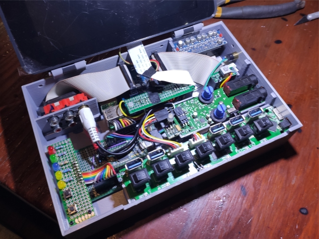](images/Looper2_01.jpg)

This readme can be viewed as **inheriting** certain information and content presented in
the *[Looper1](looper1.md)* readme.  For instance, in 3D printing **this** box, I used the same
**frame for the rPi official 7" touchscreen** that I had already printed for **that** box, and
it also contains the same basic core components, the **sound card** (*Audio Injector Octo*)
and **teensy 3.2**, as were in that box, ableit in a sligthly different physical configuration.

There was enough room left over in the [Looper1](looper1.md) box that I figured I could
incorporate the **iRig2 HD** USB audio card, and the 7 port **usb hub** from my previous
*(hackaday) [SynthBox1](https://hackaday.io/project/168197-synthbox-1) box (project).* within
this box, and eliminate a piece of hardware and several cables from my live rig.

### Stuff from previous ["SynthBox1"](https://hackaday.io/project/168197-synthbox-1)

I had previously modified the circuit board from an inexpensive **7 port USB hub**
to replace two of the USB port connectors with dupont connectors.  For this
project, I removed those two *dupont* connectors and replaced them with more
secure, real, white *PCB connectors*:

[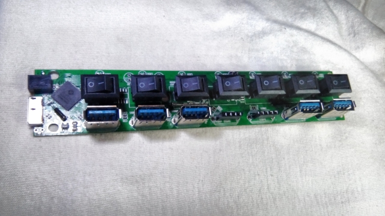](images/Looper2_11.jpg)
[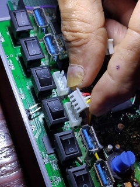](images/Looper2_12.jpg)

Also from that project I took the **iRigHD2 board** which I had *already modified* to
replace the 1/8" audio jack and micro USB connectors with *male headers*,
bring the *Activity LED* to the the "top" by adding a small circuit board extension,
and by adding a *Pad Switch* to allow me to change the impedance of the 1/4 input plug
to work better with my guitar.

[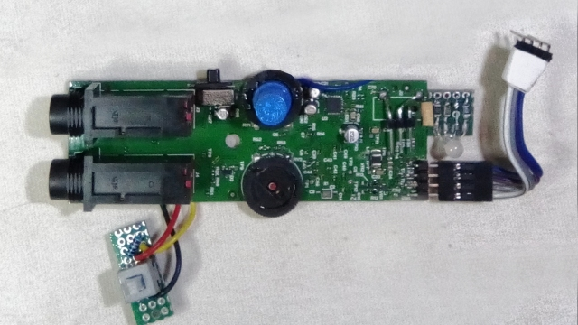](images/Looper2_13.jpg) *modified iRigHD board*

[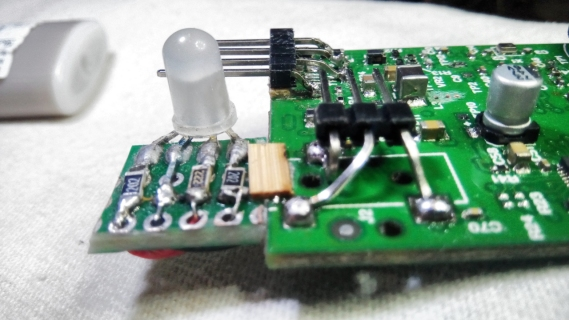](images/Looper2_14.jpg) *iRigHD2 Activity LED addition*

[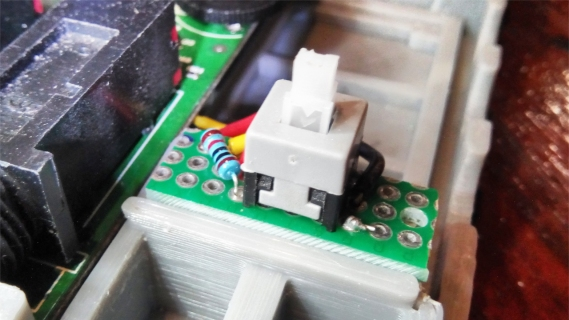](images/Looper2_15.jpg) *iRigHD2 Pad Switch Addition*

### Assembly

I then measured everything, did the 3D design work in fusion, and printed a new **box**
for this version.  Notable changes from the previous box include:

- The **RCA inputs** are now internal to the box ... as the audio output of the *iRigHD2*
now connects directly to the *Octo* audio inputs.  This **eliminated an external cable**.
- I added a separate **USB Port** for the
**[teensyExpression pedal](https://github.com/phorton1/Arduino-teensyExpression)**
- The **Teensy Circuit Board** was moved to the left side of the box.   This necessitated
adding a micro-usb "extension" port, as well as reworking the *LED Display board* and
*rPi-teensy connector*
- **supports** for the iRig2HD, the USB router, the Pad switch board, and the new location
of the teensy board and LED display board.

The *3D printing files* (fusion, STL, and gcode) for printing this bo
can be found in the **/3DP** folder of this repository.

[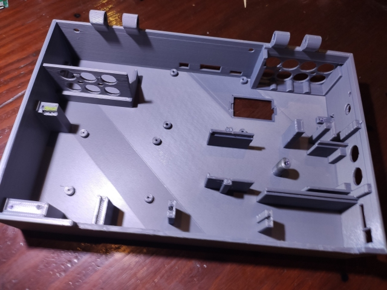](images/Looper2_21.jpg)

Below is an image showing the removable *SD Card Cover* that lets you swap the SD card
out of the rPi without disassembling the box, and another image showing the new location
of the *Teensy* circuit board along with the *teensy-rPi connector* (from which I have
de-soldered and removed the wires in preparation for modifying them to fit the new
configuration).

[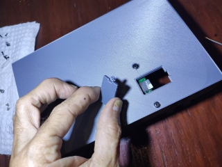](images/Looper2_22.jpg)
[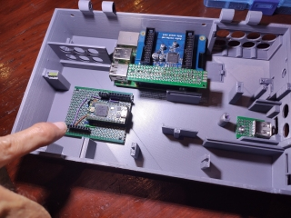](images/Looper2_23.jpg)

The first image below shows the *reworked rPi to Teensy connector* on top of the Octo card, and
connected to the teensy.  Also in that image you can see the attached *micro USB extension for the Teensy*
and the *USB Port extension* waiting to be connected to the *USB Hub* and let me plug the
*teensyExpression* pedal into the side of the box.

[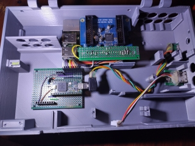](images/Looper2_24.jpg)
[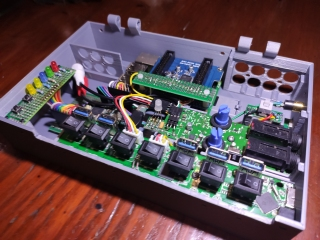](images/Looper2_25.jpg)

The second image above shows the box with the addition of the *LED Display Board*
(and it's new cable connector), with the *iRig2HD and USB Routers* installed, and you
can see the *1/8 jack* for the additional teensy serial port.

Below is the box with all the *guts* installed, except for the Octo *RCA
connectors* and the *screen*.  It it you can see two 3D printed pieces that
make up the *top* of the box.

[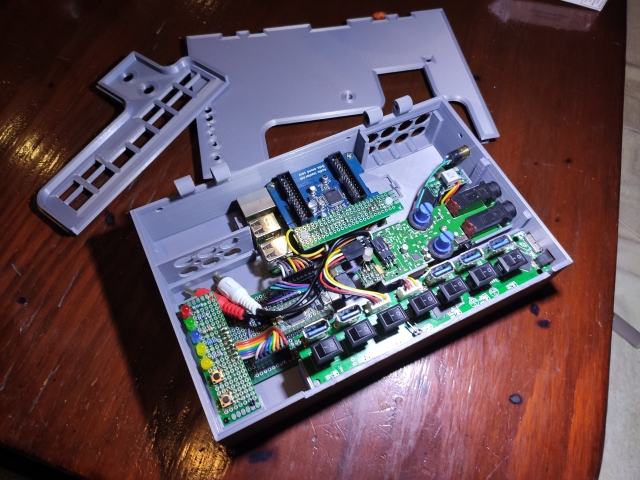](images/Looper2_26.jpg)

The two parts of the top are glued together with superglue, and then
(after drying) the assembled top is attached to the box with 3mm screws
so it can be removed later as needed.

### Connections

In the below image you can see the connections on the right side
of the box.

[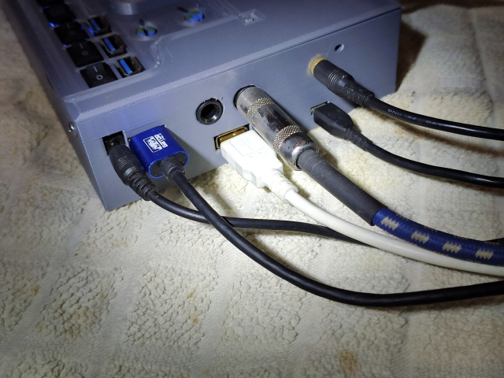](images/Looper2_31.jpg)

From left to right in the above image, the connectors are:

- **5V** power supply (input) to the USB hub.
- **USB Hub Connector** to the iPad
- the white cable plugged into the **USB Port** to the *teensyExpression pedal*
- the **1/4" Guitar** input
- the **Teensy micro USB connector** and above it,
- the **1/8" Serial Port**,  also to the *teensyExpression pedal*

The USB hub ends up **powering** the *teeenyExpression pedal* and the *iRigHD2*.
The actual *teensy* in **this** box (and the *rPi*) are both powered by the rPi
power connector (not shown here) on the **back** of the box.

*A future iteration of this box will likely consolidate the power supplies into
one connector*.

In the above image, we are **not using** the *left 1/4 jack* which is an additional output from the iRigHD2,
and the *Teensy micro USB connector* is only used during development to communicate
with, and program, the teensy and rPi from my **development machine**.

[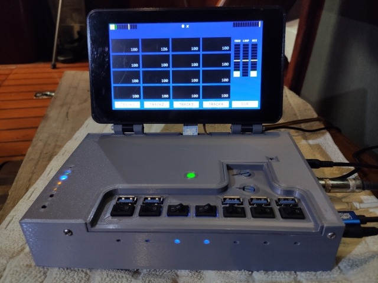](images/Looper2_32.jpg)

And finally, in the above image you can see the full box, running the *Looper* program.
To the *left* you have the vertical column of **LEDs and buttons** for the teensy and rPi,
showing that the program is running correctly, the *center* **iRig Activity LED** (green)
shows that sound is coming into the iRigHD (and not overdriving the inputs, which would cause
the LED to turn red), and a square hole where you can insert a tool to change the **Pad Swtich**.

On the "sunken" portion of the top, that leaves the 5 available *USB ports*, the *7 switches* that control them
and the two gain control *potentiometers* (input gain and output volume) for the iRig.   I have marked
where I like those two pots with a magic marker.

On the front of the box, there are the seven LEDs indicating power to the USB hub ports.
The two blue LEDs show that the power is "on" for the USB to the
*iRigHD* and the *teensyExpression pedal*, respectively.

**TODO: Want an image of the whole rig, with teensyExpression and iPad, here**

*---------------------- end of Looper2.md ------------------------
