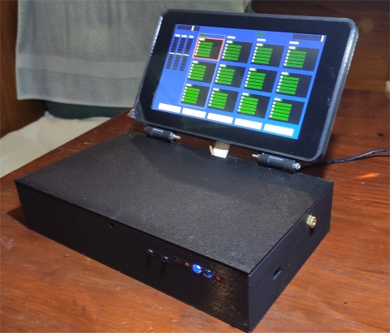
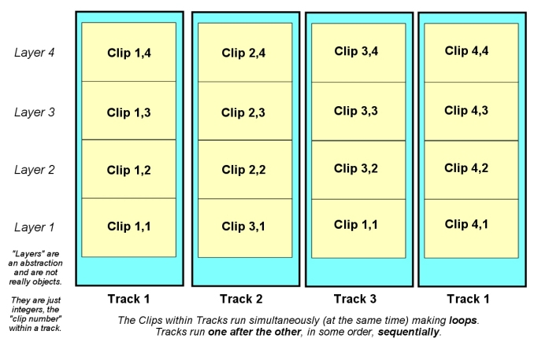

# rpi Bare Metal Looper

**Home** --
**[Hardware](hardware.md)** --
**[Software](software.md)** --
**[UI](ui.md)** --
**[Protocols](protocols.md)** --
**[Details](details.md)** --
**[Looper1](looper1.md)** --
**[Looper2](looper2.md)**

This repository contains the source code and other information required to
build a bare metal rPi based Audio Looper.

Looper1 *running an earlier version* of the program.

This project brings together what, until now, have been multiple disparate parts of the puzzle,
and is a milestone in my **[rPi bare metal vGuitar rig](https://hackaday.io/project/165696-rpi-bare-metal-vguitar-rig)**
hackaday project.

It is based on my prior projects (repositories) which include my fork of the
**[circle](https://github.com/phorton1/circle)** rPi bare metal C++ framework,
and my extensions to it, including a port of the Teensy Audio library to
rPi bare metal, in my **[circle-prh](https://github.com/phorton1/circle-prh)** repository.

The box (my bare metal rPi development environment) also has a Teensy 3.2 board
in it (for serial communications with, and control of, the rPi).  So the
**box** ALSO includes the **[teensyPiLooper](https://github.com/phorton1/Arduino-teensyPiLooper)**
*INO program* which runs on the Teensy 3.2 in it's own repository.
The teensy communicates with, and controls, the rPi, as well as commmunicating with my
3D printed teensy 3.6 MIDI controller pedal, the
**[teensyExpression Pedal](https://github.com/phorton1/Arduino-teensyExpression)**
via serial data.

Together these projects, along with a **Fishman Triple Play** pickup and an **iPad**
running *Tonestack* and *SampleTank* inside of *AudioBus*, form an **actual working rig**.
A set of physical, working hardware, that I can take to a gig, put on the floor, plug in,
and use to play guitar with *effects*, a *midi synthesizer*, and controllable *live loops*
with a user interface (foot pedal) that I like, and that can be somewhat easily extended
and programmed.

Above is a photo of the first 3D printed version of the Looper.  There have
been several phsyical iterations of the *box* and the *software continues to
be developed*.

## Organization of Documentation

This *readme* presents some basic concepts and a glossary.  The bulk of
the information about the *Looper* is found in the following separate
readme files:

- **[Hardware](hardware.md)** - Describes the physical hardware
   implementation, which **includes** the specific **sound card**
   I am using, the *Audio Injector Octo*, as well as the **separate teensy 3.2**
   running the *[teensyPiLooper](https://github.com/phorton1/Arduino-teensyPiLooper)*
   INO program.

- **[Software Architecture](software.md)** -
    Describes the overall architecture of **this** C++ program (the *Looper*), which
    runs in an environment that includes **[circle](https://github.com/phorton1/circle)** and
    **[circle-prh](https://github.com/phorton1/circle-prh)** extensions.

- **[User Interface](ui.md)** - Describes the window, buttons,
   and overall **behavior** of this *Looper* from an end-user perspective.

- **[Protocols and Communication](protocols.md)** - Describes, in more detail
   how **communication** with the *Looper* happens, particularly the two way
   communications it has, via serial data, with the
   *[teensyExpression Pedal](https://github.com/phorton1/Arduino-teensyExpression)*.

- **[Implementation Details](details.md)** - Describes
  implementation details of the *Looper* including things like
  the overal **process management** of the program, and details like
  how **crossfading** in looping works.

- **[Looper1](looper1.md)** and **[Looper2](looper2.md)** -
  Contains the **3D printing information** and details about the
  contents and construction of the specific instances of the *Looper* box I have
  created, which all generally use the above hardware implementation,
  sofware architecture, and communication protocols, presenting the same user
  interface, but which differ only in their **physical contents**, and ***context***,
  within my overall
   *[rPi bare metal vGuitar rig](https://hackaday.io/project/165696-rpi-bare-metal-vguitar-rig)*
  project.

### Please Also See

- my **[rPi bare metal vGuitar rig](https://hackaday.io/project/165696-rpi-bare-metal-vguitar-rig)**
hackaday project.
- my fork of the **[circle](https://github.com/phorton1/circle)** rPi bare metal C++ framework
- my extensions to circle, including a port of the Teensy Audio library to
rPi bare metal in the **[circle-prh](https://github.com/phorton1/circle-prh)** repository.
- the **[teensyPiLooper](https://github.com/phorton1/Arduino-teensyPiLooper)**
repository which contains the small INO program that runs on the Teensy 3.2
- my 3D printed teensy 3.6 MIDI controller pedal, the
**[teensyExpression Pedal](https://github.com/phorton1/Arduino-teensyExpression)**

## Note on Terminology - "Looper"

The term ***Looper*** is highly overloaded.

It can refer to a piece of software, i.e. a program like *Quantiloop* running on
a consumer computer like an *iPad*, or it can refer to
a dedicated standalone consumer *hardware looper*,
like a Boss Foot Pedal or the looper integrated into a guitar multi-effects device ...
or in my case, it can refer to an *instance of the 3D printed box* I have made that sits on the floor,
***OR*** an *abstraction* of the sum of all the electrical hardware and software
programs running inside that box, **taken as a whole**, or even a more, specific
*part of this software*, the **Looper program** in ***this*** repository, which runs in
bare metal on a *Raspberry Pi*.

Sorry! It's not my fault!

I will generally, in this discussion, use the term *Looper* to loosely refer to the
program, the software, in **this** repository.

In detailed discussions the word
also may occasionally be used synonymously with  a specific **part of *this
software*** ... the *"loopMachine"* as defined in the **Looper.h** and **loopMachine cpp**
files, is sometimes referred to as *"the Looper"* in discusions and/or source
code comments.

At least I can disambiguate a little of it.

When I refer to **Looper1** or **Looper2**, I am talking about the instances
of the 3D printed box I put on the floor.  They are **not** really different in
their basic architecture and/or use of this code.

Looper2 (TODO: need a way better pic)

The main difference between *Looper1* and *Looper2* is that *Loooper2*
incorporates what was previously an external USB Audio Device, and an external
USB router, ***INTO*** the physical 3D printed box.  This eliminated (at least)
one piece of external hardware from my **rig** and goes to the architecture,
and the realization of a milestone in my
**[rPi bare metal vGuitar rig](https://hackaday.io/project/165696-rpi-bare-metal-vguitar-rig)**
hackaday project.

*But* the difference between Looper1 and Looper2 **is not signficant** in
a discussion of **this repository**, and the program herein.  The same basic
programs run, and the same software, hardware, protocols, and so on, are (were)
used in/with both of them.

## Basic Concepts - Glossary

  The *Looper* consists of four **tracks** that can record and play sequentially, each
  with four *layers* of **clips**, that can play simultaneously at any given time.

  This conceptual arrangement of *tracks, clips, and layers* applies not only to this
  program, and it's user interface, protocols and communication, and implementation,
  but also to my other closely related project, the
  *[teensyExpression Pedal](https://github.com/phorton1/Arduino-teensyExpression)*,
  which shares these concepts, and some important **constants** with this program.

  - a **clip** represents a single piece of recorded sound. A clip can be *empty*,
  or it can be *recording*, or it can be *recorded* AND *playing* or *stopped*.
  - a **track** represents upto four clips that are recorded and/or can play together
  synchronously, at any given time.
  - the **layer** of a clip is it's position within a track.

  *The number of tracks and clips are **constants** in the code. 4x4 works well
  for me at this time, with the given screen real estate, and the controllers
  I use, but it is relatively easy to to modify those constants in the code
  to larger, or smaller valus.*

### Clips versus Tracks

  *Clips* play simultaneously, in parallel while *tracks* play sequentially, at
  different times.

  The idea behind *tracks* is that you can have separate **loops** (sets of *clips*)
  for different parts of a song, for example, the INTRO, VERSE, CHORUS, and END
  of a given song. And you can record them, and play them back, in various orders,
  to **build up**, and **perform** a live-looped song.

  Only **one track** is playing, or recording, at any given time.  Generally, when
  a track is playing, *all the clips in it are playing simultaneously*, though each
  can be have different *volumes* and/or be individually *muted*.

  A track is *playing* if any clips within it are playing. A track is *recording*
  if a clip within it is being recorded. A track can be simultaneously playing
  and recording at the same time.

  A track is *running* if any clips within it are recording or playing. The currently
  *running* track is referred to as the **current track**.

  A track is *empty* if all the clips in it are empty.  A track is *stopped*
  if it has at least one recorded clip and is not *running*.

  ### Base Clip, Integer Multiples, and Loop Points

  The first clip recorded in a track is **special**.  It is called the **base clip**,
  and is unconstrained in length.

  **You determine** the length (duration) of the *base clip* when you record the first
  clip in a given track. *Subsequent clips* recorded in a given track **must be** (are) **an
  integral multiple** of the *length* (duration) of the *base clip* in that track.

  A clip **loops** when it is playing and it reaches the end and jumps back to the beginning.
  This is generally called a ***loop point***, and the *loop point* of the *base clip* is
  somewhat special, as it will always be the **next** *loop point* encountered while any
  track is playing.

  Because the clips are integral multiples of the base clip in length (duration), they will,
  generally, synchronize to their beginnings in a predictable manner.  Yet, because you can
  record *different integral multiples* for each clip, they do not necessarily all *loop*
  **together** to the *common beginning* at the same time.

  But eventually they do, as a function of the multiples used. If the numbers are all the same,
  the song will have a rigid predictable structure.  If they are all different, you can build
  songs that don't seem as repetitive to the audience, which take advantage of the different
  clip lengths.

  However, regardless of the actual integral multiples used, algorithmically, eventually
  all clips will cycle back to synchronize to their beginning at some point in time.

### Looper Commands and Pending Commands

  The *Looper* can be issued certain **commands**, for instance to begin recording a track,
  or to begin playing one.

  There is a concept of the **selected track** which can be different than the current track.
  Once again, the currently *running* (recording or playing) track is referred to as the
  **current track**.

  Some *Looper Commands* **may not take place immediately**.

  For instance, if ***Track1*** is *playing* and ***Track2*** is *empty*, and you
  desire to record on Track2, you issue the **Track2 Command** (press the Track2 button) sometime
  while Track1 is playing.   Instead of immediately stopping Track1 and
  beginning to record Track2, the looper will **wait** until it reaches the next
  *loop point*, allowing the base clip (phrase) to complete before stopping Track1
  and beginning to record Track2.

  For that duration, during that window of time, these are called **Pending Commands**.

  While the command is pending, the *current track* is playing, but the *selected track* can be
  said to be **pending** a state change.  Thus, in this example, at the moment you press the Track2
  button (issue the *Track2 Command*), Track2 **becomes** the *selected track* ... different than
  the current one, Track1 (which is *playing*) ... and Track2 is said to have a  *"pending state"*
  ... namely that it is *PENDING RECORDING*.

  This distinction, between the *selected* and the *current* track, and the notion of
  **Immediate** vs **Pending Commands** and a track's *pending state* are important to
  understand, as the are reflected throughout the project(s) in the user interface and
  implementation.

### Layers versus Clips

  This is a relatively minor detail.

  Generally these terms are used somewhat interchangably depending on context.

  The **layer** of a clip is it's position within a track. This is
  an abstraction of a horizontal *slice* of the above diagram.

  There are no *objects* for *layers* in the system, but there ARE objects for
  **tracks** and **clips**.

  In practice, a *layer* is usually just an *integer* that
  identifies a clip within a track, and is also sometimes
  called *the clilp number*.

### Personal Note

I can, **finally**, present the overall architecture
of the system!

It is complicated.

This, for me, is a substantial documentation effort.

I hope to follow it up with some **YouTube videos** demonstrating the *Looper*.

Thanks for visiting this page.  I hope you find it entertaining and/or useful.

-- Patrick

**[Home](readme.md)** --
**Hardware** --
**[Software](software.md)** --
**[UI](ui.md)** --
**[Protocols](protocols.md)** --
**[Details](details.md)** --
**[Looper1](looper1.md)** --
**[Looper2](looper2.md)**
