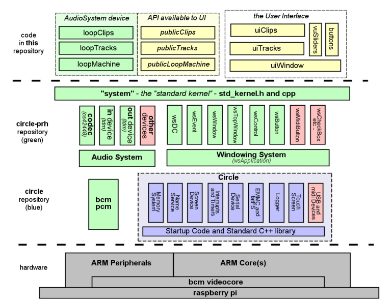
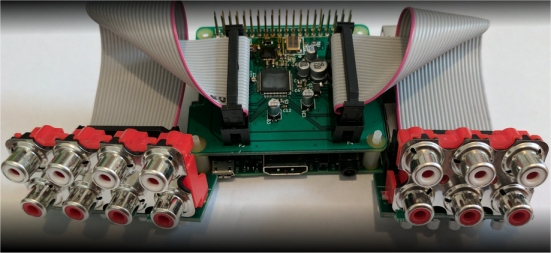
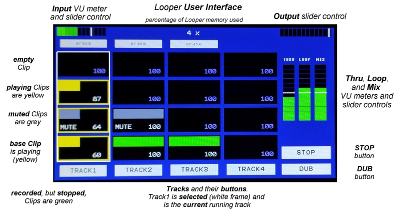
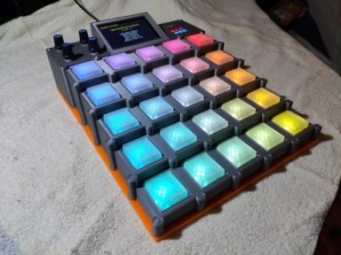

# Software Architecture - rpi Bare Metal Looper

**[Home](readme.md)** --
**[Hardware](hardware.md)** --
**Software** --
**[UI](ui.md)** --
**[Protocols](protocols.md)** --
**[Details](details.md)** --
**[Looper1](looper1.md)** --
**[Looper2](looper2.md)**

This readme describes the **Software Achitecture** of the **rPi BareMetal Looper**.
which runs in an environment that includes **[circle](https://github.com/phorton1/circle)** and
**[circle-prh](https://github.com/phorton1/circle-prh)** extensions.

**This repository** contains the *Looper* program, which is a specific *application*, using
specific subsets of the circle and circle-prh repositories (libraries). *Much of this discussion
could be compartmentalized into the other referenced repositories, but for the time being
I am trying to present a single, understandable, overall architectural description of
**how it all works**, rather than trying to minimize my documentation footprint!*

*When this is done, I will **probably** upddate (add) more generalized architectural
discussions to those other repositories,*

## Basic Architecture

The *Looper Application* consists mainly of an **Audio System Device**, the *loopMachine*, and a
single **wsTopWindow**, the *uiWindow*, which constitutes the *user interface*.  The
**loopMachine** has four (4) **loopTracks** which each own four (4) **loopClips**.

Likewise the **uiWindow** has four **uiTracks** which each have four **uiClips**.

Between the *loopMachine* and the *user interface* there is an abstraction layer of
the *loopMachine* called the **publicLoopMachine**, with it's corresponding **publicTracks**
and **publicClips**.  The *User Interface* **can only see** the *publicLoopMachine*.  It has no
visibility of, or direct access to the *loopMachine*.

The **loopMachine** runs all the time as an *interrupt driven audio system device*, therefore
it is very important that it runs quickly, and in a known state. The objects
in the *loopMachine* have *API's* that are visible to each other as appropriate to implement the
core behavior of this interrupt driven *Looper*, but that are **not** visible to the UI.

The **pubicLoopMachine** is a set of pure virtual base classes that are implemented by the
loopMachine, and available to the UI, that carefully grants **readonly** access to
the state of the loopMachine, with **specific methods** (*entry points*) that the UI
can call, like the ***publicLoopMachine's command()*** method to *change it's state*, to cause
the *loopMachine* to actually **do** something.

[](images/LooperArchitecture.jpg)

Below the top dashed line you see the **circle-prh** and **circle** libraries/repositories.  Some
of the boxes in that diagram are in **red**, indicating, and implying, that there is (much)
code in those libraries that does not happen to get used in this specific application.

The other boxes are **examples** of the specific objects and kinds of code that are used
from those libraries, and do not reflect an *exhaustive* list of the specific objects and
code.  But this diagram does show the most important parts of those libraries to this application,
including the use of three of the specific *"prh*" subsytems (subdirectories):

- the **Audio System**, the objects within (above) it, and below it, the important common **bcmpcm** (cpp & h) object.
- the **Windowing System**, and some of the objects within it, and ...
- at the top, the (overloaded name) **system** subdirectory, which contains the
basic framework (*"glue"*), the *standard kernel*, in **std_kernel.h and cpp** that
ties everything together into *applications* written in this environment.

By the way, when all of this code is built (compiled and linked) it results in a *single file*
named **kernel.img** (the exact name depends on the rPi model), which is then copied (somehow)
to the SD Card on the Raspberry Pi, and which is then subsequently booted.  In other words, every
complete *application*, at this time, in this sytem, is built and run as an
**operating system kernel** in common parlance. *There is **no linux** or other
operating system involved*. That's why we call it **bare metal**!!

**ALL of the code** running on the rPi is in these three repositories.

In **circle** the most important objects (classes) necessary to build a complete
program (**kernel.img**) in this system, includes (but is not limited to):

- the **CMemorySystem** - initializes the rPi memory system (MMC)
- the **CDeviceNameService** - provides for named devices
- the **CScreenDevice** - the HDMI or rPi screen device
- the **CInterruptSystem** and **CTimer** - basic interrupts and timers
- the **CSerialDevice** - the rPi UART driven serial port
- the **CEMMCDevice** and *addOn* **FATFS** classes for the SD Card
- the **CLogger** - a generalized Logging device to Screen or Serial ports
- the **CTouchScreen** - the VideoCore, or other, TouchScreens

Once again, to point out, I included some **red** boxes in the diagram to specifically
show that we are **not** using all of the code in the circle-prh and circle libraries.

For example, in **circle-prh** we are not making use of many of the *AudioSystems*
devices that are availble, including **mixers**, **reverbs**, and so on,
nor many of the **WindowSystem** objects that are available like **checkboxes**,
**midi buttons**, and so on. Nor are we inluding anything from entire *"prh** subdirectories,
including the **devices**, **lcd**, and/or **bt** subdirectories, in this specific application.

In fact, my intention was/is to keep the *Looper* program as simple as possible.

In *circle* I specifically am *NOT* using the circle **USB** capabilities (for performance
reasons), nor the **USB Midi Device** that it makes available.  There is a *ton* of other
functionality in circle that I am not using ... including any of it's *sound devices*,
or it's entire approach to audio, either of it's two available *entirely different*
addon *windowing systems*, or many of it's other *add on* extensions. Above is merely a list
of the most important circle objects that we **are** using in this build.

Finally, at the bottom, below the lower dashed line, is the **hardware** itself, abstracted
in this diagram to the notion that there are one or more **arm cores** (cpus) available to us,
depending on the model of raspberry pi used, but that all of them include
the **arm peripherals** which are the low level programming API's and protocol to things like
*I2S* and *UARTs*, supported by the chip, and that all of **that** runs on top of the
(mysterious and undocumented) Broadcom **VideoCore**, which is a separate CPU on the
**Raspberry Pi** board.


## The BCM_PCM and the AudioSystem as used in this application

Perhaps the most important object in the *AudioSystem* is the **bcm_pcm** object (h and cpp files).

The **bcm_pcm** provides an interface to the BroadCom *PCM Peripheral*, and implements
a generalized approach to the **I2S** (*Inter IC Sound*) protocol to interface the **rPi** to
various **sound cards**. It uses **DMA** to send and receive *buffers* of sound data
to and from the sound card based on **interrupts**.

In this application we are using the *AudioInjector Octo* sound card.
The *Octo* is a 6 (six) input, 8 (eight) output sound card.

[](images/AudioInjectorOcto.jpg)
*AudioInjector Octo sound card*

In this application we are only using two
of the input channels and two of the output channels (the *Looper* is **stereo**),
but underneath the hood, the system is *processing* the data for all 6 input channels
and 8 output channels.  The *Octo* runs as a (pseudo) **TDM** (time division
multplexed) device. We are running it at **44.1 khz** with **16 bit** samples,
and a **buffer size** of 128 samples **times** eight (8) channels.

The *initialization* of a sound card takes place in the **control** device, so in
this case the, with the cs42448 based *Octo*, we are using the **control_cs42448**
(h and cpp) device in our system.  When using this control device, you also need
to use the **AudioInputTDM**  and **AudioOutputTDM** devices from the *AudioSystem*.

The *bcm_pcm* generally handles the buffering of input and output data, using *DMA* on
an interrupt driven basis.  When it has received an input buffer, it then proceeds
to pass it to the *Audio System*, either directly in a single core system, or via
an inter-processor interrupt in a *multi-core Circle* application.   The *Looper*
is built as a multi-core appclication running, at this time, on a **raspberry Pi 3B+**.

The *bcm_pcm* (and all rPi interrupts) runs on **core 0**.

The *application* registered the specific *control* and *TDM* input and output devices
with the AudioSystem. It also registers the *loopMachine* (which is, itself, a stereo
*Audio Device*) during **setup()**. The AudioSystem runs on **Core1**.

When the bcm_pcm *hands off* the buffer to the AudioSystem, it then,
in turn, passes it to the registered **AudioInputTDM** device.

The **AudioInputTDM** device then de-multiplexes the data into a set of per-channel
buffers. Plese note that at this time, in this application, at this level of
processing, the system is **actually** processing the entire set of *6 input channels*.
When the *input_tdm* has prepared the buffers, it in turn passes them to the
back to the AudioSystem, which passes them to the registered *loopMachine*.

This *loopMachine* is only interested in, only uses, the first *stereo pair*
of input buffers available to it.  It works with those buffers, possibly
*recording them* by copying them off into RAM someplace (in *looperClips*), and
produces the final stereo output pair of buffers by processing the input buffer
**thru** to the output, applying volume levels and noting the minimum and maximum
values in the buffer(s) for the vu meters. It also possibly mixes previously
recorded buffers (**playing** *looperClips*) into the stream, likewise
applying volume levels and noting values for the vu meters,
finally resulting in a pair of **output** buffers that it (the *loopMachine*)
passes back to the *AudioSystem*.

The *AudioSystem* then passes those final buffers to the **AudioOutputTDM** device
where that object multiplexes the data back into I2S buffers, and provides those back
to the *bcm_pcm* for output to the sound card via I2s.

## Application Initialization and basic UI Framework

In this *typical* application, the **standard kernel** handles (makes) the
various calls to the AudioSystem and WindowSystem (does the *process management*
in the system) to orchestrate the overall behavior and functionality of
the program.

With regards to the *WindowSystem* (the **user interface**), the system first calls a
specific method, **wsApplication::Create()** that the *application must supply* that
**instantiates** the user interface.

**This** application (*Looper*) merely instantiates the *uiWindow* object
with the following small piece of code in **app.cpp**:

```
void wsApplication::Create()
{
    LOG("wsApplication::Create(%08x)",this);
    new uiWindow(this,ID_WIN_LOOPER,0,0,getWidth()-1,getHeight()-1);
}
```

The uiWindow then creates the objects within it (the *uiTracks, uiClips, vuSliders*,
and *wsButtons*) and returns.

[](images/ui01-UI_annotated.jpg)

wsWindows, and objects derived from them, implement an **onDraw()** method that the
system can call.

Once the *Top Level Window* is intantiated, the *system* ensures that it is drawn
on the screen at the correct time (by recursively calling wsWindow's **onDraw()** methods),
and that it (the top level window) receives *wsEvents* (like EVENT_CLICK) via it's
**handleEvent()** method.

*wsWindows* also have a method called **updateFrame(()** that is called frequently
(30-100 times a second or more) separate from events, that constitutes the **ui thread**.

The *uiWindow* uses calls to it's *updateFrame()* method (which it in turn passes
to *updateFrame()* methods on the *uiTrack* and *uiClip* objects) to query the
*pubicLoopMachine* and corresponding *publicTracks* and *publicClips* for state
changes that must be reflected in the user interface.

For example, a uiClip displays a "moving" *"bar"* that represents a
recording or playing track in progress, that changes, and must be redisplayed, as
the recording or playback progresses, based on the value of **publicClip's**
*getRecordBlockNum()* or *getPlayBlockNum()* methods.
Likewise, uiTrack displays a frame around the the *selected* track (based on
calls to **publicTrack's** *isSelected()* method, and uiClip shows **pending commands**
by flashing the frame around a uiClip on and off in various colors (red for *record*,
yellow for *play*, and white for a pending *stop*) based on the **publicClip's**
*getClipState()* method, combined with the value returned by the **publicLoopMachine's**
*getPendingCommand()* method.

Note that windows do not draw themselves from within the *updateFrame()* method.
They merely **update** their state, and if they need to be redrawn, they set their
own **WIN_STATE_DRAW** bit, and at a later time, in a coordinated manner, all windows
with that bit set will be redrawn (have their *onDraw()* methods called) by **the system**.


## Audio System Initialization and Framework

As noted in the **[circle-prh](https://github.com/phorton1/circle-prh)** repository,
this **port of the teensyAudio system to the rPi** exposes an *Arduino-like* approach
to the instantiation and initialization of *AudioSystem* objects.  AudioSystem objects
can be *statically* or *dynamically* allocated.

The **system** (*std_kernel.cpp*) calls the static global **setup()**
method once at the start of the program.

*There is also a familar Arduino-like static global **loop()** method,
that runs on the AudioSystem thread (*Core1*), and IS called, but this method is
generally left **empty** in my typical applications, as we want the AudioSystem
to run un-impeded.  Remember that the **UI** (WindowSystem) runs on a **different
core**.*

The AudioSystem *setup()* method is in the file **audio.cpp**,
and looks something like this:

```
#include <audio\Audio.h>
#include "Looper.h"

AudioInputTDM input;
AudioOutputTDM output;
AudioControlCS42448 control;

loopMachine *pTheLoopMachine = 0;
publicLoopMachine *pTheLooper = 0;
    // static global pointers to objects available, by convention, with
    // externs in Looper.h, to the loop machine itself, or to the
    // more limited "public" UI version of the object

void setup()
{
    pTheLoopMachine = new loopMachine();
    pTheLooper = (publicLoopMachine *) pTheLoopMachine;

    new AudioConnection(input,      0,      *pTheLooper,       0);
    new AudioConnection(input,      1,      *pTheLooper,       1);
    new AudioConnection(*pTheLooper,   0,      output,         0);
    new AudioConnection(*pTheLooper,   1,      output,         1);

    AudioSystem::initialize(200);

    pTheLooper->setControl(LOOPER_CONTROL_OUTPUT_GAIN,0);
    pTheLooper->setControl(LOOPER_CONTROL_INPUT_GAIN,0);
}
```

Though there are other things in the *Looper's* **audio.cpp** file, like
**#defines** that let you choose the other available *Codec* and *Input/Outtput devices*,
and the fact that the **setup()** method, after executing the above code,
then goes on to *fade up* the input and output gains to their default values,
the above is, more or less, all that is necessary for an *application* to instantiate
and initialize the *AudioSystem*.

#### **loopMachine specifics - commands and pending commands**z

The *system* will call the loopMachine's **update()** method once per the *interrupt cycle*
of bcm_pcm-I2S *input buffers*. The loopMachine  processes those buffers, and at the end of
update(), calls it's own virtual **transmit()** method to *"send them back"* to the
AudioSystem, who will then eventually send them to the *AudioOutputTDM* device, which
in turn multiplexes them and gives them to the *bcm_pcm* to send out to the sound card
via *I2S* on the next output interrupt.

The other *main input to the loopMachine* is (by the uiWindow calling)
the *publicLoopMachine's* **command()** method.

The *command()* method will be called by the UI, typically in response to a
button press, but also, in detail, in response to the uiWindow receiving some
**serial midi data** via the rPi SerialPort, which it *monitors* in it's
**updateFrame()** method.

One way or the other, though, to the UI and external clients, *the (public)LoopMachine is
essentially an interrupt driven black box state machine*.  You merely pass commands to it,
for instance to *clear* it, or to *begin recording a clip*, but most of those commands
are handled completely separate from the basic loopMachine **interrupt driven update()**
method, via the **pending command** mechanism.

Remember that the UI is running on one core, and the Audio System on a different one.

We want to make sure the AudioSystem (which is already an interrupt handler)
is not itself *interrupted* or held up in any way.   So, when commands are issued
to the *loopMachine*, they usually result in a **pending command** that
will be processed in the loopMachine's *update()* method at some later
time, typically at a **loop point**.

*Some* commands, like *CLEAR LOOPER* and *STOP IMMEDIATE* are handled immediately.

A list of the commmands that can be issued to the *Looper* can be found in
**commonDefines.h**.

#### **loopMachine controls - volumes and vu meters**

Another set of entry points into the publicLoopMachine are a set of API's
that allow the UI to query and adjust the overall volumes used by the Looper.  There are five
controllable global volumes on the loopMachine.

- **INPUT** - controls the basic (hardware) input gain of the Codec
- **THRU** - controls how much of the input is passed through to the *mix*
- **LOOP** - how loud is the loop (any playing *cips*) passed to the *mix*
- **MIX** - a volume control for the *mix* before passing the buffer(s) to the ...
- **OUTPUT** - hardware output gain of the codec

Most of these volume controls have an associated **meter** API on the loopMachcine
that allows the UI (the *vuSlider* objects) to obtain the minimum and maximum
levels of the given control, over some interval of time, and to display it.

All of the above controls *except the final OUTPUT control* have **meter APIs**
on the publicLoopMachine, associated with them. *We cannot **meter** (monitor) the actual
final OUTPUT values as that takes place in hardware!  But for all of the others,*
the loopMachine::update() method *remembers* the high and low values for
each stage as it processes each buffer, and presents an API
for the UI to read and reset them.

Those methods are *polled* during the **vuSlider's** *updateUI()* method.

Note that, as it does for *Loop Commands* sent via serial midi, the **uiWindow**
also monitors the serial port for **serial midi CC messages** that correspond
to each of the above controls, and converts those messages into the appropriate
calls to the aforementioned loopMachine API's.


#### **loopClip - volumes and muting**

The **publicClips** present an API that allows the UI to obtain,
and/or modify the Clip's individual **volume** level and/or to **mute** it.

A clip is **still running** (playing or recording) EVEN IF IT IS MUTED.

The clip volume and mute state are *applied* when each clip makes
it's contribution, if any, to the *output buffers*, in it's own **update()**
method.

As with the other **serial midi** stuff, the **CC's** for affecting
the individual volumes and mute states is coded in the *uiWindow*,
with constants in *commonDefines.h*,
which maps them from serial midi messages into specific method calls on the
*publicClip* objects.


#### **Serial Midi Notifications** also happen in the uiWindow objects

As the loopMachine is running, changes to it's state (the machine,
tracks, and/or clips), as we've seen, must necessarily be reflected in
the corresponding UI objects.

[](images/teensyExpression01.jpg)
*teensyExpression midi controller pedal*

Furthermore, serial clients, like the
*[teensyExpression Pedal](https://github.com/phorton1/Arduino-teensyExpression)*,
in addition to wanting to **control** the loop machine, by *sending* serial
midi commands to the Looper, want to be notified about changes to it's state,
by *receiving* serial midi.  For example, the pedal want's to know
*when a loopPoint is reached* in it's implementation of the **songMachine**,
and it wants to know when a *track state* changes (*empty*, *recording*,
*playing*, or *stopped*) and/or if there is a currently *pending command*.
so that it can **light up** the *track buttons* in various colors, and
**flash** them for pending commands.

Therefore, when the **UI objects** (uiWindow, uiTrack, and uiClip) notice
that something has changed (in their updateState() methods), they typically
will *also* send out a **serial midi notification** message, which the client
device (the **teensyExpression pedal**) can then use to keep track of,
utilize and to display, what's happening with the *Looper*, in real time.

Once again, the specific **CC numbers** and *parameter values* for these notification
methods are defined in **commonDefines.h** (which is  denormalized to, and
included in the *[teensyExpression Pedal repository](https://github.com/phorton1/Arduino-teensyExpression)*.


## Other General Notes


#### **Other sound cards could be used**

I chose the *AudioInjector Octo* because, to me, it sounded the best of any
audio cards I tried to work with on the raspberry pi.  The fact that it has
a whopping 6 inputs, and 8 outputs, is viewed merely as a *bonus*.

The *AudioSystem* also currently has support for the *AudioInjector Stereo* in
**control_wm8731.h and cpp** as well as the *teensyAudio Card* in **control_sgtl5000.h
and cpp**, and either of those *should* be usable with this *Looper*.

It should also be relatively straight forward to implement *other sound cards* into
this system and application.  I am just not aware of many others that do both **input**
and *output*. *If you know of a **great** sound card that does both input and output on the
raspberry Pi, I would like to hear about it!*

#### **This is a general *Audio Application* development platform**

This *Looper* project is but one of the possibiities that could be written
using this set of libraries. Especially to the degree that the *AudioInjector
Octo* presents 6 inputs and 8 outputs, it could also be viewed as a
**audio application development platform** for developing other
rPi based audio "devices".

A couple of examples come to mind.

First, please note that the rPi3B+ has **four cores** and that at this time
we are only using *three* of them.   **Core0** is dedicated to interrupt processing
and inter-process communications.  In this program Core0 doesn't actually *run* anything ...
it just waits for, and processes, interrupts.
The *AudioSystem* runs on **Core1**, and the *WindowingSystem* (UI thread) runs
on **Core2**.

So, at this time, **Core3** is unused, and available.

It might (*should*) be possible, and practical, to implement, for example, a set
of **guitar effects** that run on Core3, that do not impact the current behavior
or timing of this *Looper*.

And/or, within this basic framerwork, by *expanding* the *loopMachine*
and/or adding objects (like the existing *Audio System* **reverb** and/or **mixer**
devices) to create a Looper which, itself has *effects*, and which works on, and with,
the entire 6x8 (six by eight) set of inputs and outputs, for example, to let you
**separately** loop your **voice** from looping your **guitar** .. or to even have
separate *loop channels* for every member of the band.

The point of this section is that although it works, and I consider it part
of my *rig*, this *Looper* project is **really** just an example of the kinds
of things you *could* build with this system.


*------------- end of softare.md ------------------*
