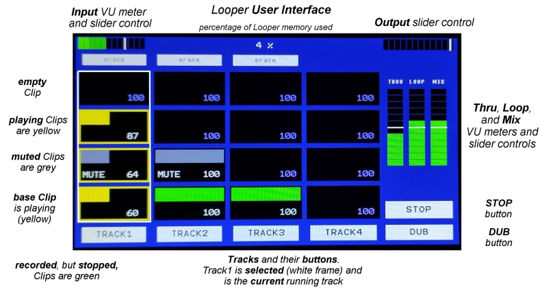

# User Interface  - rpi Bare Metal Looper

**[Home](readme.md)** --
**[Hardware](hardware.md)** --
**[Software](software.md)** --
**UI** --
**[Protocols](protocols.md)** --
**[Details](details.md)** --
**[Looper1](looper1.md)** --
**[Looper2](looper2.md)**

This readme file describes the **User Interface** of the *rPi BareMetal Looper*,
including the window, buttons, and overall **behaviors** presented by the program,
from a user's perpective.

The looper **touchscreen** display shows most of the salient features of the UI
and can be used to control (and describe) most of the *behaviors* of the looper.
*However, there are aspects of the Looper's **behavior** that are not accesible
via the touchscreen and which are only available via **LoopCommands** over the
serial port*.

[](images/ui01-UI_annotated.jpg)

## UI Basics

**VU meters and slider controls** - there are *VU meters* with touch sensitive
*sliders* for the **Input**, **Thru**, **Loop**, and **Mix**.  The final **Ouput**
control is merely a slider ... it does not have a VU meter. You move the *white bars*
on the VU sliders by *touching and dragging* them to adjust the various volumes.

**Buttons** - there are *buttons* for the **four tracks**, the **Stop** and
**Dub** buttons, and, for *recorded* tracks, **erase** buttons above the tracks.
Buttons can be *pressed*, and some can be *long-pressed*, or *pressed twice*
for different behaviors.

- the behavior of the **Track Buttons** will be described in detail, below.
- **Long Pressing** either the *Stop* or *Dub* buttons **stops** and **clears the looper**.
- the **Stop** button does not show until the loopMachine is *running* (a clip
  is *recording* or *playing*).
- A *short click* on the *Stop* button will cause the loopMachine to stop
  *at the next **loop point***, finishing the current phrase (*base clip*)
  before doing so.
- Once the *Stop* button has been pressed (in other words, while the stop command is *pending*),
  the button label changes to **STOP!** (with an exclamation point).  Pressing
  it (again) at this time will cause the looper to **stop immediately**.
- the **erase** buttons do not show until at least one clip is *recorded* or
  *recording* on the given track.  If the track is recording, a *short press*
  on the erase button will **abort** the recording (but keep playing the other
  clips on the track, if possible).
  A *long press* on on one of the erase buttons will **erase the track**, and if
  it is the *current* playing or recording track, will stop the loopMachine.

Clips and Tracks

- The **currently selected track** is highlighted with a *white frame*.
- Clips have a solid frame that matches their *state* and/or that **flashes**
  if they are *pending* a state change.
- Clips that are *playing* or *recording* have a **bar** that moves from left to right
  as the the looper runs.
- Clips that are **solid green** are *recorded*, but *stopped* at this time.
- A Clip with a moving bar that is **red** (not shown above) is *recording*.
- A Clip that is *pending reording* will have a **flashing red frame** (with no bar).
- Clips with moving bars that are **yellow** are *playing*.
- Clips that are *pending play* have a **flashing yellow frame** and a solid green bar.
- Clips that are *pending stops* have **moving yellow or red bars** and a **white flashing frame**.
- Clips that are **muted** are shown in **grey** (looks like grey-blue in above photo)
  and have the word *"MUTE"* in the lower left portion of the clip.
- Each Clip shows it's **volume** as a number from 0 to 127, where *100 means
  unity gain* (no volume change).

Touchscreen on Clips

- **pressing** (clicking) on a clip will *mute* or *unmote* it
- **pressing and dragging up or down** on a clip will change it's volume

Memory Usage

The *Looper* shows the percentage of memory used at the top of the screen.
*As currently implemented, I am conservatively using **128M** (about 1/8th
of the rPi3B's **1GB**) of RAM for the Looper.*  This allows for **1440 seconds**
(about 20 minutes) of recording stereo clips in the Looper for a given song,
which should be enough for most uses. *The constant **LOOP_HEAP_BYTES** in
Looper.h can be changed to increase this if desired.*

### Touchscreen UI versus Serial Midi control

Each of the active UI elements above, the *volume sliders*, the *track buttons*,
the *erase buttons*, the *dub* and *stop* buttons, can also be controlled via
**serial midi data**.  In fact, the touchscreen UI is *implemented in terms of*
**Loop Commands** and various other entry points to the loopMachine, loopTrack,
and loopClip *objects*.

For example, pressing the **Track1 button** causes the **uiWindow** to issue the
**TRACK1** *Loop Command*. to the *loopMachine*.   This *exact same behavior* can
be effected by sending the *serial midi data* for LOOP_COMMAND_TRACK1 to the
serial port of the *Looper*.

To comprehensively describe the **behavior** of the *Looper* it is best to
describe it in *abstract terms* that apply both to the *touchscreen UI* and
the *serial midi protocol* it accepts, especially since there are *aspects
of the Looper behavior that are currently only availalbe via serial midi
data* and which are NOT reflected in the touchscreen UI.

So when we refer to *pressing a button* we are also describing the behvior
when the LoopMachine *responds to* certain **serial midi** "commands" (messages),
and typically, vice-versa.

## Loop Commands

Here is a list of the existing *Loop Commands*.  These are the core functions of the *Looper*.

- **CLEAR_ALL** (corresponds to a *long-press* of either the *Dub* or *Stop* buttons) - stops the
*Looper* if running and clears (**erases**) all tracks and clips.  It also resets all
*clilp volumes* to 100, and clears the *mute* state of all clips.
- **TRACK1-4** (corresponds to pressing one of the four *track* buttons) - will be explained more, below.
- **STOP** (corresponds to the first press of the *Stop* button) - issues a **pending stop** command
  to the *currently running* Track (clips) if any, which will then stop gracefully at the next *loop point*,
  or, if *recording a base clip* to **immediately stop** and save the recording.
- **STOP_IMMEDIATE** (corresponds to the "second" press of the "Stop" button) - stops the
  *Looper* **immediately**, aborting any *recording* currently in progress.
- **DUB_MODE** (corresponds to a press of the "Dub" button) - tells the *Looper* that the
  **next** *TRACK1-4 command* should **record** instead of *playing*
- **LOOP_IMMEDIATE** (not currently reflacted in touchscreen UI) - causes all Clips in the
  currently running Track to **imemdiately** jump back (loop) to their starting points.
- **SET_LOOP_START** (not currently reflacted in touchscreen UI) - sets a **mark point** that
  the Clips will begin looping back to when they reach the next *loop point*.  This lets you
  create a *sub-phrase* **within** a Track, and loop it (without otherwise altering the cilps
  themselves).  This can be used, for instance, at the end of a song, as is common,
  to repeat the last part of the chorus 3 times before ending.
- **CLEAR_LOOP_START** (not currently reflacted in touchscreen UI) - clears any existing **mark points**
  for the selected track. All tracks **mark points** are **automatically cleared** upon any track
  change, and, of course, when the Looper is cleared.
- **ABORT_RECORDING** (corresponds to a *short click* of one of the *erase* buttons while a clip is recording) -
  abort the current recording, if any.  If there are other *recorded* playing clips in the track, the track
  will continue *playing*.  If not, the *Looper* will stop immediately.
- **ERASE_TRACK1-4** (corresponds to a *long click* of one of the *erase* buttons) - **erase**
  the given track, so that it can be re-recorded from scratch.  If the given track is the
  *current* playing or recording track, the *Looper* will stop **immediately**.

### LOOP_COMMAND_TRACK1-4

The **core functionaity** of the looper revolves around
pressing one of the four **Track** buttons (or sending
one of the four *Track Loop Commands* to the Looper via *serial midi*).

[](images/ui02-empty.jpg)
*Empty*

The *behavior* (what happens) when one of these commands (buttons) is issued (pressed)
depends on the **state** of the Looper (and the state of the *Dub* button) when the command is
issued.

- From a *stopped or empty looper*, pressing one of the four track button on an
  *empty* track will cause that track to **begin recording** the *base clip*
  for that track.

[](images/ui03-recording.jpg)
*Recording base_clip*, after pressing **Track1** first time

- Pressing the *Stop* button while recording a *base clip* will *determine
  it's length* (duration), save the recorded track and **stop** the Looper immediately.
- Pressing the **same** track button while recording it's *base clip* will
  *determine the clip's length* and **immediately** save the recording and begin
  *playing it* (start *looping*).

[](images/ui04-playing.jpg)
*Playing* (looping), after pressing **Track1** second time

- Pressing a **different** track button while recording a *base clip* will
  *determine it's length* and **immediately** save the recording. If the
  **newly *selected*** track is *empty* it will **immediately begin recording**
  it's *base clip*.   If the new track has content, it will **immediately
  start playing**.

Basically, from an *empty or stopped Looper*, or while recording a *base clip*, the
Track buttons (commands) act **immediately**.

- If the Looper is **stopped** (with some *recorded* clips), pressing one of the
Track buttons for a track that has content will cause it to **immediately** begin
*playing* that track.
- Pressing the Track button for an *empty* track on the *stopped* looper
will cause that track to **immediately** start recording the *base clip*
for the track.


### The "Dub" button - Recording a second Clip within a Track

As we pointed out, pressing the **same Track button** while recording the
*base clip*, or pressing a Track button on a track with content while the
Looper is stopped, will cause the Track to start *playing* (looping).

**But what if you want to record another Clip on the track?**

The answer is that you first press the **Dub button** *before* you press
the *TrackN* button.  If the Dub button is lit up (has been pressed)
it turns **orange**, and will take effect on the next Track button press.

So, for example, from an empty looper, to *record( Clip(1,**1**)* and then
to immediately start *playing* Clip(1,**1**) and *recording* Clip(1,**2**), you
would press the following buttons (issue the following *commands*):

- **Track1** - first press *starts recording* the *base clip* for track 1.
- **Dub** - pressing the Dub button sets the **one shot** *dub mode* for
the next Track button press.  The Dub button turns **orange**.
- **Track1** - the second press of the Track1 button **immediately**
starts *playing* the *base clip* WHILE *recording* the **2nd clip** .

The *Dub* button is a **one-shot** button.  It is **not** a *mode*.
Once the command takes effect, the *Dub button is cleared and
will no longer be **orange** (active)*.  You have to press it
*every time* you want to overdub.


### Otherwise, TrackN commands will be pending commands

The *Looper* will enforce the rule that **all clips in a track
have a duration (length) which is an integral multiple of the
base clip duration**.  So, after the *Track1-Dub-Track1* button presses
in the previous section, if you then (more or less) immediately
pressed the *Stop* button, while the base clip
was playing, **the looper would not stop**!

In the below image, within the white framed Track, the **frames around the clips** are **flashing**
yellow and red.

[](images/ui04-pending.jpg) *Pending Clip States*

In the above photo, the yellow *base clip* is playing, the red *clip2* is recording, but *both*
have flashing yellow frames indicating that they are **pending playing** at the next loop point,
and *clip3* is **pending recording** with a flashing red frame.

It will keep *recording* Clip2 until the *loop point*, then it will
start recording the Clip3 the flashing will stop.

This behavior also happens when you click *a different* **Track** button.

*When the base clip is playing* the Looper is said to be **looping** and
all **Track Commands** are executed as *pending commands* ... they take
effect upon the **next** *loop point*.

So, for example, if you have **two recorded tracks** and are playing one
of them, you press the *other track button* well *in advance of* when you
will start jamming over the next track.  This *fire and forget* behavior
is **really handy** so that, except for the *base clips*, you don't have
to be concerned about the **exact timing of your button presses** when
building and jamming over live loops.  You just press the button
any time during the *playback of the base clip* and at the next
*loop point* the Looper changes Tracks, and starts plsying and/or
recording the (clips on the) next Track.

You can even **change your mind** about button presses after performing
them because **only the most recent issued track command will happen
at the next loop point**.   So if you accidentally pick the **wrong Track**,
or decide that you **really don't want to record another clip**, you can
effectively **cancel** or change the command by pressing one of the
track buttons, including the track button for the currently playing
or recording track, ***as long** as you issue the new command
before the **loop point***.

### Loop Commands not reflected in the Touchscreen UI

There are a couple of *Loop Commands* that are not available, at this time, via the touchscreen.
It would be easy to add buttons for them to the *touchscreen UI*, but *I don't really
**use** the touchscreen UI*, except, generally, for *testing the Looper*.
My actual use of the Looper is via **serial data** to and from the
*[teensyExpression **foot** Pedal](https://github.com/phorton1/Arduino-teensyExpression)* which
sits on the floor.

Those *Loop Commands* not available in the UI are:

**LOOP_IMMEDIATE** - causes all Clips in the currently running Track to **imemdiately**
  jump back (loop) to their starting points.   You use this when you want to repeat
  *just the beginning* of a Track one or more times.

**SET_LOOP_START** - sets a **mark point** that the Clips will begin looping back to
when they reach the next *loop point*.  This lets you create a *sub-phrase* **within**
a Track, and loop it (without otherwise altering the cilps themselves).
There are a lot of songs that have a *CHORUS* where, at the end of the song, you
need to **repeat** *part* of the CHORUS, a single phrase, three times, and then you end
the song.

So, for example if you had recorded a **Track** for
*"Mary had a little lamb who's fleece was white as snow"*, and
at the end of the loop you wanted to repeat the *"white as snow"*
sub-phrase three times, then stop, you would:

- **be** *playing* the Track to begin with
- when it gets to the word *white* the first time, you would press the *SET_LOOP_START* button, then ...
- when it gets to the *loop point* (the end of "snow"), the Looper will go back to the
"white as snow" sub-phrase, **instead** of jumping back the beginning of the loop.
- That will start the *second* time through. After that ....
- You let it loop one more time, and then press the *Stop* button **any time** during
the *third*, final, time through, and ....
- the Looper will come to a stop after the word "snow".

The *LOOP_IMMEDIATE* and *SET_LOOP_START* commands (buttons) can be used together
*albeit manually* to **repeat the middle of a Track**.

With *automation*, as takes place in the
*[teensyExpression's](https://github.com/phorton1/Arduino-teensyExpression)*
**songMachine**, interesting pre-programmed sequences of behaviors of the Looper
can be orchestrated that would not otherwise be possible by manually pressing
buttons.


### Other Serial CC "commands" and "notifications"

For completeness, there are also **serial midi** surrogates for the other
functionality of the *Looper UI* including, setting the overall *volume levels*,
and/or the *mute/unmute* state and *volume* of the individual clips, as well
as to be **notified** when the *state* of the looper changes.

Those are defined programatically in **commonDefines.h**

```
LOOP_CONTROL_BASE_CC   0x65   // cc is the vol control. value is 0..127
LOOP_STOP_CMD_STATE_CC 0x26   // tells client if the stop button should be lit
LOOP_DUB_STATE_CC      0x25   // tell client if dub button should be lit
LOOP_COMMAND_CC        0x24   // the value is the LOOP command
TRACK_STATE_BASE_CC    0x14   // for 0..3 tracks, value is track state
CLIP_VOL_BASE_CC       0x30   // for 4 tracks * 4 clips - value is volume 0..127
CLIP_MUTE_BASE_CC      0x50   // for 4 tracks * 3 clips - value is mute state
NOTIFY_LOOP            0x64   // sent at loop points
```

These are sent, or received, by the *[teensyExpression pedal](https://github.com/phorton1/Arduino-teensyExpression)*
to control the *Looper* and/or change the **state** (the LEDs of the buttons, screen, etc) **of the foot pedal** so
that it shows what's happening with the *Looper*.  For example, the *teensyExpression* has
Track1-4 buttons, just like the *Looper* and those buttons, with addressable colored LEDS,
that can be set to green, yellow, or red, and/or can **flash** just like the *frames around clips
on Looper screen*. This provides a completely separate, yet consistent, floor based (foot pedal),
User Interface to the Looper.


*-------------- end of *ui.md* ---------------------*