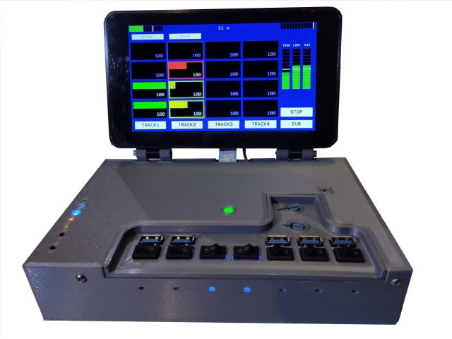

# rpi Bare Metal Looper

This repository contains the source code and other information required to
build a bare metal rPi based Audio Looper.

Please see the **[docs/readme.md](docs/readme.md)** file for
the [documentation](docs/readme.md) regarding this project.
