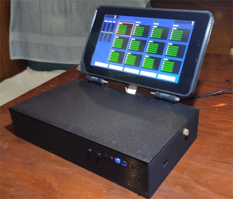

# rpi Bare Metal Looper

**THIS PAGE IS UNDER CONSTRUCTION**

This repository contains the source code and other information required to
build a bare metal rPi based Audio Looper.

This project brings together what, until now, have been multiple disparate parts of the puzzle,
and is a milestone in my **[rPi bare metal vGuitar rig](https://hackaday.io/project/165696-rpi-bare-metal-vguitar-rig)**
hackaday project.

It is based on my prior projects (repositories) which include my fork of the
**[circle](https://github.com/phorton1/circle)** rPi bare metal C++ framework,
and my extensions to it, including a port of the Teensy Audio library to
rPi bare metal in my **[circle-prh](https://github.com/phorton1/circle-prh)** project.

The box (my bare metal rPi development environment) also has a Teensy 3.2 board
in it (for serial communications with, and control of, the rPi).  So the
box ALSO includes the **[teensyPiLooper](https://github.com/phorton1/Arduino-teensyPiLooper)**
repository which contains the code which runs on the Teensy 3.2 that communicates
with, and controls, the rPi via serial data, as well as commmunicating with my
**[teensyExpression Pedal](https://github.com/phorton1/Arduino-teensyExpression)**
via serial data.

Above is a photo of the first 3D printed version of the Looper.  There have
been several phsyical iterations of the "box".  The 3D printing information
(fusion, STL files, etc) for that can be found at **[TBD]** and the second
iteration, the one I am currently on as of this writing, can be found at
**[TBD]**

This readme file is mostly concerned with the software aspects of the project.
Details about the electrical circuits, schematics, etc, can be found in the
[hardware/](hardware/) subfolder.

## THIS README FILE IS UNDER CONSTRUCTION ##

The information below this point needs to be updated.  It is
generally "correct", but very badly organized.

I really need to (and can, finally!) present the overall architecture
of the system. It is complicated.

This Looper is only one piece in the (my) vGuitar rig.  And with
this milestone I can now describe, have a better vision, of how
it all fits together.  So there is one, highest level view of the
"system" which includes not only this Looper box, but the
teensyExpression pedal, as well as the "stuff" running on an
iPad, and how it all ends up going from my guitar into the PA.

That architectural discussion has, in this readme, been deferred
to an upcoming hackaday page or sub-project that continues in the
vein of the original *rPi bare metal vGuitar rig* project.

At a lower level, this development of an actual Circle based audio
"application" also finally gives me an opportunity to describe,
in software terms, how "it all works".  So the specific
architecture of this application is (intended to be)
discussed here .. but is not ... yet!

Today is not the day to complete that documentation
effort.  I have some other code I want, need, to write today.

So, please come back later, and take what follows with
the understanding that these were just "personal notes" that
happened to get published before the actual public "roll out" of
this Looper project.

I am keeping the notes below, for the time being, for posterities sake.

Thanks!

-- Patrick

## No USB MIDI devices

After struggling mightily with Circle and USB mice, and MIDI devices, I had to give up on them,
at least for the time being.  It seemed that both were so processor intensive as to
interfere with the Audio processing, so I have reverted to serial command input
which, so far, seems to work (Hence the teensyExpresion pedal)

## Basic Architecture - tracks, clips, (current, used, and selected)

The looper consists of 4 sequential "tracks" with upto 4 layered "clips" per track.

## BASE CLIP, LOOP POINTS, MULTIPLES, and PENDING COMMANDS

There is the notion of the BASE CLIP in a track, which is
just the first (0th) clip in the track.  The 0th clip in a track is
always recorded first, and is called the "base clip" because the length
of it determines the length of all the other clips in the track, which
must be integral multiples of the base clip length (1z, 2x, 3x, etc).

# CROSSFADES

I had a working implementation of the basic Looper
I noticed the need for "cross fades".  Cross fades have made the whole
thing MUCH more complicated.

The issue is that you cannot just start and stop playing recorded waveforms
instantaneously with good results.   In practice, if you start playing back
and looping a raw recording, what ends up happening are very noticable "clicks"
in the playback.

If the recordings are very quiet, or silent, at the beginning and ends, then
there are no clicks, but if you are recording a continuous sound that crosses
that boundry, then, the waveforms at the end don't match up back to the beginning,
resulting in those artifacts.

The buffers, which contains 128 samples, which are numbers from -32K to +32K,
when taken as a whole, describe the waveform to be reproduced digitally,
and usually, they will start in the middle of a sound (with a nonzero value)
and end in the middle of another sound (with another nonzero value). So,
instead of a smooth wave being produced by the transition, you (statistically
very likely) get an abprupt "spike" or change in the waveform, and the resulting
click.

BTW, FWiW, at 44.1Khz (CD quality sound) there are about 350 (stereo) buffers processed
per second per clip, so there's lot of processing going on.

So, what is needed, what I implemented, is that when the sound loops back into
itself, we "cross fade" it ... that is, we "fade out" the first instance of the loop
as we "fade in" the 2nd instance.  This "fading", by the way, is simply a mathematical
linear process on the samples as we render them.

But orchestrating it is complicated.

Although the cross fade I implemented seems to work best at about 100 milliseconds
(1/10th of a second), for illustration, to show why I took this approach, lets say
that I want one full second of fading in and fading out (overlap) in a given loop.
Let us further say that the clip is EXACTLY 15 seconds in duration from the user's
perspective.  I will try to illustrate:

    0   1   2   3   4   5   6   7   8   9  10  11  12  13  14  15  16
    [this is the duration of the sound the user expects to loop ] ^^^
                                                                   |
    this is an extra second of sound  ---------------------------- +
    I must record to make that happen

If I (the looper) only recorded 15 seconds of sound for the user's 15 second
loop, and if I (the looper) want to fade out and in for one second, I would
**not have the samples to do it!** ... If I only recorded 15 seconds, I would
need to artificially "cut" the loop time to 14 seconds!!

That's why I chose one full second of cross fade for my example.
Clearly a loop that was off by one full second from when you pressed the
buttons would be unusable.   The user more or less expects the loop duration
to be exactly the duration between their button presses, not some algorithmic
function of it!  Especially not off by a full second!

So, what I (the looper does) is when you are recording clip(0,0) and press the PLAY
button at exactly 15 seconds, we DO start playing clip(0,0) from the begining
(WITH a one second fade in), BUT we CONTINUE recording "off the end of it"
for another full second ...

Then the second time we get to the end of the 15 seconds, we play that extra second,
but fading it out this time, as we simultaneously start playing the next time through
from the beginning, fading it in.

So, all clips are recorded a little longer than the button presses (for the base
clip) or LOOP POINT (for subsequent clips).

In the implementation, the cross fade time is represented as a number of
CROSSFADE_BUFFERS to keep, where, once again, at 44.1Khz, there are about
350 buffers per second, so in this illustation CROSSFADE_BUFFERS would be
about 350 buffers (1 second), but the actual working value in the code is more
like 30 buffers(about 1/10 of a second).

My initial proof of concept implementation showed that this eliminated
the clicks quite nicely from a continous human voice and will likely
be "good enough" for my purposes.

## Crossfade State Machine is Complex

This added a tremendous amount of complexity to the state machine.

Whereas in the "simple" state machine, a "clip" only needed one "pointer"
into it's buffers (the current buffer pointer for playback OR recording),
now the system must maintain multiple pointers into the buffer, as a
single clip may be simultaneously playing AND recording, or playing
in TWO different places, at the same time.

And in fact, two completely separate tracks may be playing and/or
recording at the same time!

This also affects, and is affected by "pending" commands, and goes
to the above discussion about "cancelling" a pending command. In the
previous "simple" state machine, I could get away with just replacing
the "pending command" with a new one (or deleting the old one) as there
was no interaction between "previous" and "next" clips recording or
playback.
